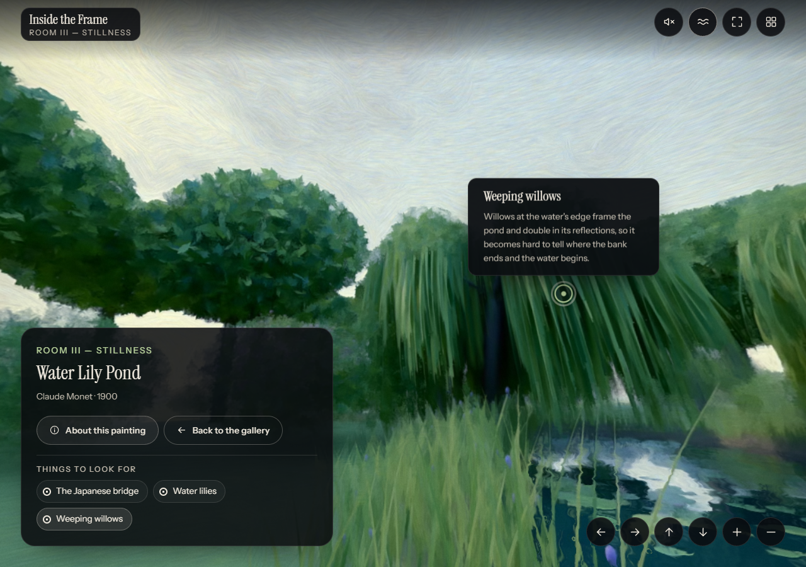
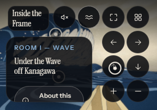
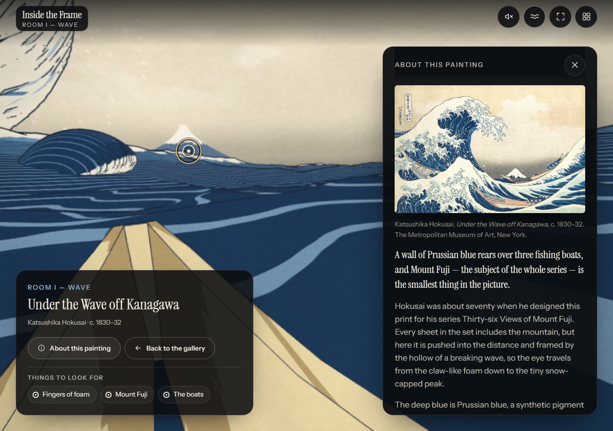

## Resultado

La auditoría encontró nueve fallos. Los nueve están corregidos. Al comprobarlo apareció un décimo que la auditoría no había visto; también está corregido.

Con las correcciones, Inside the Frame **cumple los 44 requisitos de WCAG 2.2 AA** que le aplican, y **los 40 de WCAG 2.1 AA**, la referencia legal. Antes fallaba en 8 y en 6: era parcialmente conforme con las dos.

La versión corregida está publicada. El 10 de octubre repetí sobre https://artgallery360.art/ la prueba de cada fallo y la pasada automática, con el mismo resultado que en local.

## Qué tiene de difícil este proyecto

Un panorama 360° es una imagen que no cabe en la pantalla. Para verla hay que girarla, y el gesto natural es arrastrar. De ahí salen cuatro problemas que una web corriente no tiene:

- **La imagen es todo el contenido.** Un `alt` de una línea no sirve: hay que contar un mundo entero a quien no lo ve.
- **El arrastre deja fuera** a quien no puede mantener pulsado mientras mueve la mano: ratón de cabeza, seguimiento ocular, temblor.
- **El texto flota sobre un fondo que cambia** según adónde mires. Su contraste no es un número, es un rango.
- **Lo que tienes detrás también existe.** Teclado y lector de pantalla tienen que poder llegar a un cuadro que no está en pantalla.

La primera ficha decía que el proyecto resolvía bien el primero y el cuarto, el tercero a medias y el segundo no. Ahora resuelve los cuatro. La vista se gira con botones, un clic por paso. Cada sala lista sus puntos de interés y te lleva hasta cada uno. Todo el texto que flota sobre el panorama tiene un fondo propio o una sombra que lo separa del cielo.

## Cómo se ha comprobado

- **Cada fallo, con su propia prueba.** La auditoría dejó, para cada hallazgo, unos pasos que cualquiera puede repetir. Se han repetido tal cual, en las mismas páginas y condiciones, y además se ha comprobado el arreglo: girar y abrir puntos solo con clics y toques, entrar al 400 %, medir otra vez el contraste píxel a píxel.
- **Lo que podía romperse.** Arreglar una cosa rompe otras que no se ven a simple vista. Se pasó axe en los mismos 25 estados que en la auditoría, se repitió el barrido de teclado parada a parada en las cinco páginas y se hizo un recorrido completo solo con teclado, en escritorio y en móvil: entrar, ir a una sala desde su cuadro, abrir un punto, cambiar de sala, abrir otro. También colores forzados, movimiento reducido, espaciado de texto, orientación y tamaño de los botones.
- **El mismo entorno.** Chromium 148 con Playwright 1.60.0, sin ventana y con WebGL por software; escritorio a 1280×900, móvil táctil emulado a 375×812 y 812×375, zoom al 200 % (640×450) y al 400 % (320×225). axe-core 4.11.4 con las reglas de WCAG 2.0, 2.1 y 2.2 A y AA.
- **Sobre qué.** Primero sobre la versión corregida, compilada y servida en local, comparada con la web de entonces cuando hacía falta un «antes». Después, ya publicada, sobre https://artgallery360.art/: la prueba de cada fallo y axe en los mismos estados, sin ninguna violación.

## Lo que funciona

Todo lo que funcionaba en la primera ficha sigue funcionando. En resumen:

- **Todo se maneja con teclado**, sin trampas, y Escape cierra lo que se abre.
- **Un indicador de foco que se ve sobre cualquier fondo**, y la vista gira sola hasta lo que tiene el foco.
- **El foco va donde debe** al abrir y cerrar el diálogo «Rooms», el panel de descripción y las notas, y al llegar a otra sala.
- **Alternativa textual de verdad:** cada sala se describe por escrito y cada obra tiene un `alt` que cuenta la composición.
- **El sonido es opcional** y **la animación se puede parar**. Ahora la pausa también para el pulso de los puntos.
- **Sin destellos.** Los giros nuevos duran menos de medio segundo y con movimiento reducido son un salto.
- **Colores forzados, zoom y espaciado.** Los botones nuevos y la lista de puntos se leen y se operan con colores forzados. Al 200 % y al 400 % no se pierde nada.
- **Objetivos cómodos.** Los botones nuevos miden 46 px; los de la lista de puntos, 36 px de alto.

## Lo que se encontró y cómo se ha arreglado

Los nueve de la auditoría, por orden de gravedad, y al final el que apareció al comprobarlos. Entre paréntesis, el criterio de WCAG y su cláusula de EN 301 549.

### 1. La vista 360° solo se giraba arrastrando — Crítico (2.5.7 · 9.2.5.7, WCAG 2.2) — Corregido

**Antes.** Sin arrastrar, en la galería solo se veía y se podía pulsar uno de los cuatro cuadros. En Stillness no había forma de llegar a «Weeping willows». En el móvil se quedaban fuera cuatro de los doce puntos de interés, y su texto no estaba en ningún otro sitio.

**Arreglo.** Seis botones abajo a la derecha, con el mismo aspecto que los de la cabecera: mirar a la izquierda, a la derecha, arriba y abajo, acercar y alejar. Cada clic gira 45° (25° arriba o abajo). Y en la tarjeta de cada sala, una lista, «Things to look for», con un botón por punto: al pulsarlo, la vista gira hasta él y se abre su nota.

**Comprobación.** Solo con clics, y en el móvil solo con toques: las cuatro etiquetas de la galería se ven y se pulsan (en escritorio, 1, 3 y 5 clics de «Look right» para Rain, Stillness y Moonlight); «Weeping willows» aparece con un clic de «Look left» y se abre con otro; los doce puntos se abren desde la lista, enteros y con el foco puesto en ellos.

### 2. Al 400 % no se podía entrar — Crítico (1.4.10 · 9.1.4.10) — Corregido

**Antes.** A 320×225 (una pantalla de 1280 px al 400 %), los botones «Enter with sound» y «Enter in silence» quedaban por debajo del borde y la página no se dejaba desplazar. Dentro de las salas, la cabecera se montaba sobre la tarjeta y las notas se cortaban por los lados.

**Arreglo.** La pantalla de entrada se desplaza cuando no cabe. La tarjeta de sala nunca es más alta que el hueco bajo la cabecera y se desplaza por dentro. Las notas eligen el lado donde caben y, si no caben en ninguno, se desplazan y se pueden enfocar. El panel empieza bajo la cabecera.

**Comprobación.** En las cinco URL, a 320×225: con la rueda aparecen los dos botones y se pueden pulsar; nada tapa la tarjeta; las doce notas caben enteras en pantalla (la del puente japonés se desplaza y llega al final con las flechas). A 320×256 y 480×270, igual.

### 3. El botón «Rooms» se quedaba sin nombre en el móvil — Grave (4.1.2 · 9.4.1.2) — Corregido

**Antes.** En pantallas estrechas, con zoom al 200 % y en pantallas táctiles, la etiqueta «Rooms» se ocultaba con `display: none` y el botón se quedaba sin nombre.

**Arreglo.** Las etiquetas de los botones se ocultan solo a la vista, así que siguen dando nombre al botón.

**Comprobación.** El árbol de accesibilidad da `button "Rooms"` en las cinco páginas a 375×812, y también a 640×450, 320×225 y 812×375. axe ya no marca `button-name` en ninguno de los 25 estados.

### 4. Con la descripción abierta, el foco desaparecía bajo el panel — Grave (2.4.11 · 9.2.4.11, WCAG 2.2) — Corregido

**Antes.** Con «About this painting» abierto, los puntos de interés seguían recibiendo el foco aunque estuvieran debajo del panel: los doce en el móvil, «Mount Fuji» en el escritorio.

**Arreglo.** En el escritorio, al enfocar un punto la vista gira hasta dejarlo a la izquierda del panel, fuera de la cabecera y de la tarjeta. En el móvil, mientras la hoja está abierta, los puntos se ocultan y no reciben el foco.

**Comprobación.** El mismo recorrido de la auditoría (abrir el panel y retroceder con Mayús+Tab) y otro hacia delante: en el escritorio, los doce puntos con el centro a la vista; en el móvil, el foco pasa de la hoja a la cabecera sin detenerse en ningún punto oculto.

### 5. El nombre de la sala no se leía sobre los cielos claros — Moderado (1.4.3 · 9.1.4.3) — Corregido

**Antes.** En Wave y en Stillness, «ROOM I — WAVE» quedaba entre 1,15:1 y 2,3:1 sobre el cielo, y «Inside the Frame» entre 2,98:1 y 4,33:1. El mínimo es 4,5:1.

**Arreglo.** La marca tiene ahora el mismo fondo oscuro translúcido que los botones de la cabecera. En pantallas estrechas pierde la línea de sala, que ya está en la tarjeta.

**Comprobación.** La misma medición, en las cinco páginas, en escritorio y en móvil, mirando al frente y hacia arriba: la línea de sala no baja de 8,86:1 y la marca, de 13,5:1.

### 6. La pantalla de entrada perdía contraste — Moderado (1.4.3 · 9.1.4.3) — Corregido

**Antes.** La línea superior caía sobre la parte clara de la imagen (1,37:1 en Wave en el móvil). Y en las salas el panel de descripción se veía detrás de la entrada, porque solo se ocultaba cuando el script ya había arrancado.

**Arreglo.** El panel queda oculto hasta que se abre, y la sala entera no aparece hasta entrar. Detrás del texto de la entrada hay una sombra suave, y la línea superior va en el color claro del resto del texto.

**Comprobación.** La misma medición en las cinco páginas: la línea superior no baja de 5,91:1 y el «the» del titular, de 6,12:1. Detrás de la entrada ya no hay ni panel ni tarjeta.

### 7. Las etiquetas de la cabecera no se podían apuntar ni cerrar — Moderado (1.4.13 · 9.1.4.13) — Corregido

**Antes.** Al llevar el puntero hacia la etiqueta de un botón, desaparecía. Escape no la cerraba. La de «Rooms» tapaba la esquina del botón de cerrar la descripción.

**Arreglo.** La etiqueta forma parte del botón y sigue visible mientras el puntero esté encima. Escape la oculta sin mover el foco ni el puntero. El panel de descripción empieza un poco más abajo, fuera de su alcance.

**Comprobación.** En los cuatro botones de la cabecera y en los seis nuevos: la etiqueta se queda al apuntarla, Escape la oculta con el foco en el botón y el foco no se mueve. Con el panel abierto, la etiqueta de «Rooms» ya no toca el botón de cerrar, y un clic en el borde superior de ese botón cierra el panel.

### 8. En el móvil, ampliar exigía pellizcar — Moderado (2.5.1 · 9.2.5.1) — Corregido

**Antes.** El zoom de la vista solo respondía a dos dedos.

**Arreglo.** Botones «Zoom in» y «Zoom out», con los mismos límites que el pellizco.

**Comprobación.** En las cinco páginas, en táctil: un toque en «Zoom in» acerca, otro aleja. El pellizco sigue funcionando.

### 9. La pausa no paraba el pulso de los puntos — Menor (2.2.2 · 9.2.2.2) — Corregido

**Antes.** «Pause animation» paraba el agua, la lluvia y el balanceo, pero los anillos de los puntos seguían latiendo.

**Arreglo.** La pausa también los para, y vuelven al reanudar.

**Comprobación.** Tras pausar, ninguna animación del pulso en marcha en las cuatro salas, y seis capturas seguidas del anillo, idénticas.

### 10. Apareció al comprobar: una etiqueta enfocada podía quedar fuera de la pantalla — Grave (2.4.7 · 9.2.4.7) — Corregido

**Antes.** En el móvil con teclado (y en cualquier ventana estrecha), al llegar con Tab a la etiqueta de un cuadro que estaba fuera de pantalla, el navegador desplazaba la capa de las etiquetas para enseñarla. Cuando la vista terminaba de girar, la etiqueta acababa desplazada otra vez fuera. Pasa en la web publicada con «Rain» y «Stillness» a 375 px. La auditoría no lo vio porque su barrido de teclado se hizo a 1280×900, donde las etiquetas ya están en pantalla al recibir el foco.

**Arreglo.** Esa capa, y la de los puntos de interés, ya no se pueden desplazar: recortan, pero no se mueven.

**Comprobación.** Las cuatro etiquetas y los puntos de Rain y Moonlight, con Tab, a 375×812, 640×450 y 1280×900, en la web publicada y en la versión corregida: antes, dos etiquetas fuera de pantalla a 375 px; después, todas a la vista.

## Lo que queda abierto

- **Las observaciones de la primera ficha** siguen como estaban, porque no incumplen ningún requisito: el borde de los anillos de dos puntos va justo de contraste, la imagen de la entrada se mueve muy despacio sin pausa propia, y los títulos en japonés no llevan idioma marcado, entre otras.

## Resultado por principio

| Principio | Conforme | No conforme | No aplica | No evaluable | Antes (No conforme) |
|---|---|---|---|---|---|
| Perceptible (20) | 14 | 0 | 6 | 0 | 3 |
| Operable (20) | 20 | 0 | 0 | 0 | 4 |
| Comprensible (13) | 7 | 0 | 6 | 0 | 0 |
| Robusto y 9.7 (4) | 4 | 0 | 0 | 0 | 1 |
| **Total (57)** | **45** | **0** | **12** | **0** | **8** |

| Norma | Requisitos | Conforme | No conforme | No aplica | Veredicto | Antes |
|---|---|---|---|---|---|---|
| WCAG 2.2 AA + 9.7 · EN 301 549 V4.1.1 | 56 | 44 | 0 | 12 | Plenamente conforme | Parcialmente conforme (8 de 44) |
| WCAG 2.1 AA · EN 301 549 V3.2.1 | 50 | 40 | 0 | 10 | Plenamente conforme | Parcialmente conforme (6 de 40) |

Los «No aplica» son los criterios de vídeo y audio grabado (no hay) y los de formularios (no hay ninguno).

## Límites de esta evaluación

- **La firma el autor del proyecto, y el arreglo también.** Para compensarlo, cada fallo lleva su prueba repetible, y los datos de cada medición, antes y después, quedan guardados.
- **Local y publicada.** Todo se comprobó primero en local; sobre la web publicada se repitieron la prueba de cada fallo y la pasada automática, no el barrido de teclado completo ni NVDA, porque el código servido es el mismo.
- **NVDA, en los recorridos principales.** Con NVDA real escuché la entrada, la vista 360°, los botones para girar, la lista de puntos, el diálogo «Rooms», las etiquetas de la galería en móvil y el cambio de sala: todo se anuncia como debe. La escucha sacó un ajuste, ya hecho: el nombre de las etiquetas juntaba la sala y el pintor. La nota desplazable a 400 % y el panel en móvil, solo con el árbol de accesibilidad.
- **Un navegador, sin ventana y sin GPU.** Chromium 148 con WebGL por software. No se ha probado en Safari, Firefox, VoiceOver, TalkBack ni en móviles reales; el táctil y el móvil son emulados.
- **El fondo se mueve.** El contraste sobre el panorama se midió en la vista con la que abre cada sala y mirando hacia arriba. Otras direcciones pueden dar valores distintos.
- **Lo que no se pudo ejercitar.** Con «Motion look» activo, los botones de giro se revisaron leyendo el código: no hay sensor que emular.
- **Sin obligación legal.** Inside the Frame es un proyecto personal sin actividad comercial: no le aplican la Ley 11/2023, el RD 1112/2018 ni el RD 193/2023. Se evalúa contra la norma como prueba de concepto, no para declarar cumplimiento.

## Anexo — Los 57 requisitos

«Norma» indica en qué veredicto cuenta cada fila: «2.1 y 2.2», solo en 2.2 (los seis criterios nuevos), solo en 2.1 (4.1.1) o solo en V4.1.1 (9.7). «Antes» es el estado en la auditoría del 8 de octubre.

### Perceptible

| Criterio | Nivel | Norma | Estado | Antes | Nota |
|---|---|---|---|---|---|
| 1.1.1 Contenido no textual | A | 2.1 y 2.2 | Conforme | Conforme | Texto alternativo de las obras, descripción de cada mundo, vista 360° con nombre |
| 1.2.1 Solo audio y solo vídeo (grabado) | A | 2.1 y 2.2 | No aplica | No aplica | Sin audio ni vídeo grabados |
| 1.2.2 Subtítulos (grabado) | A | 2.1 y 2.2 | No aplica | No aplica | Sin vídeo |
| 1.2.3 Audiodescripción o alternativa | A | 2.1 y 2.2 | No aplica | No aplica | Sin vídeo |
| 1.2.4 Subtítulos (en directo) | AA | 2.1 y 2.2 | No aplica | No aplica | Sin directos |
| 1.2.5 Audiodescripción (grabado) | AA | 2.1 y 2.2 | No aplica | No aplica | Sin vídeo |
| 1.3.1 Información y relaciones | A | 2.1 y 2.2 | Conforme | Conforme | Botones de vista agrupados; lista de puntos con su título |
| 1.3.2 Secuencia con significado | A | 2.1 y 2.2 | Conforme | Conforme | |
| 1.3.3 Características sensoriales | A | 2.1 y 2.2 | Conforme | Conforme | |
| 1.3.4 Orientación | AA | 2.1 y 2.2 | Conforme | Conforme | Vertical y horizontal |
| 1.3.5 Identificar el propósito de la entrada | AA | 2.1 y 2.2 | No aplica | No aplica | Sin formularios |
| 1.4.1 Uso del color | A | 2.1 y 2.2 | Conforme | Conforme | |
| 1.4.2 Control del audio | A | 2.1 y 2.2 | Conforme | Conforme | |
| 1.4.3 Contraste mínimo | AA | 2.1 y 2.2 | Conforme | **No conforme** | Fallos 5 y 6, corregidos |
| 1.4.4 Cambio de tamaño del texto | AA | 2.1 y 2.2 | Conforme | Conforme | |
| 1.4.5 Imágenes de texto | AA | 2.1 y 2.2 | Conforme | Conforme | |
| 1.4.10 Reflow | AA | 2.1 y 2.2 | Conforme | **No conforme** | Fallo 2, corregido |
| 1.4.11 Contraste no textual | AA | 2.1 y 2.2 | Conforme | Conforme | Los anillos de dos puntos siguen justos |
| 1.4.12 Espaciado del texto | AA | 2.1 y 2.2 | Conforme | Conforme | |
| 1.4.13 Contenido con hover o foco | AA | 2.1 y 2.2 | Conforme | **No conforme** | Fallo 7, corregido |

### Operable

| Criterio | Nivel | Norma | Estado | Antes | Nota |
|---|---|---|---|---|---|
| 2.1.1 Teclado | A | 2.1 y 2.2 | Conforme | Conforme | También los botones nuevos y la lista |
| 2.1.2 Sin trampas para el foco | A | 2.1 y 2.2 | Conforme | Conforme | |
| 2.1.4 Atajos de una tecla | A | 2.1 y 2.2 | Conforme | Conforme | |
| 2.2.1 Tiempo ajustable | A | 2.1 y 2.2 | Conforme | Conforme | |
| 2.2.2 Poner en pausa, detener, ocultar | A | 2.1 y 2.2 | Conforme | **No conforme** | Fallo 9, corregido |
| 2.3.1 Umbral de tres destellos | A | 2.1 y 2.2 | Conforme | Conforme | |
| 2.4.1 Evitar bloques | A | 2.1 y 2.2 | Conforme | Conforme | |
| 2.4.2 Titulado de páginas | A | 2.1 y 2.2 | Conforme | Conforme | |
| 2.4.3 Orden del foco | A | 2.1 y 2.2 | Conforme | Conforme | |
| 2.4.4 Propósito de los enlaces | A | 2.1 y 2.2 | Conforme | Conforme | |
| 2.4.5 Múltiples vías | AA | 2.1 y 2.2 | Conforme | Conforme | |
| 2.4.6 Encabezados y etiquetas | AA | 2.1 y 2.2 | Conforme | Conforme | |
| 2.4.7 Foco visible | AA | 2.1 y 2.2 | Conforme | Conforme | El fallo 10, que la auditoría no vio, está corregido |
| 2.4.11 Foco no oscurecido (mínimo) | AA | 2.2 | Conforme | **No conforme** | Fallo 4, corregido |
| 2.5.1 Gestos del puntero | A | 2.1 y 2.2 | Conforme | **No conforme** | Fallo 8, corregido |
| 2.5.2 Cancelación del puntero | A | 2.1 y 2.2 | Conforme | Conforme | |
| 2.5.3 Etiqueta en el nombre | A | 2.1 y 2.2 | Conforme | Conforme | |
| 2.5.4 Activación por movimiento | A | 2.1 y 2.2 | Conforme | Conforme | El giroscopio es opcional |
| 2.5.7 Movimientos de arrastre | AA | 2.2 | Conforme | **No conforme** | Fallo 1, corregido |
| 2.5.8 Tamaño del objetivo (mínimo) | AA | 2.2 | Conforme | Conforme | |

### Comprensible

| Criterio | Nivel | Norma | Estado | Antes | Nota |
|---|---|---|---|---|---|
| 3.1.1 Idioma de la página | A | 2.1 y 2.2 | Conforme | Conforme | Inglés |
| 3.1.2 Idioma de las partes | AA | 2.1 y 2.2 | Conforme | Conforme | Los títulos japoneses son nombres propios |
| 3.2.1 Al recibir el foco | A | 2.1 y 2.2 | Conforme | Conforme | |
| 3.2.2 Al recibir entradas | A | 2.1 y 2.2 | Conforme | Conforme | |
| 3.2.3 Navegación coherente | AA | 2.1 y 2.2 | Conforme | Conforme | |
| 3.2.4 Identificación coherente | AA | 2.1 y 2.2 | Conforme | Conforme | |
| 3.2.6 Ayuda coherente | A | 2.2 | Conforme | Conforme | «How to explore» explica también los botones nuevos |
| 3.3.1 Identificación de errores | A | 2.1 y 2.2 | No aplica | No aplica | Sin formularios |
| 3.3.2 Etiquetas o instrucciones | A | 2.1 y 2.2 | No aplica | No aplica | Sin formularios |
| 3.3.3 Sugerencias ante errores | AA | 2.1 y 2.2 | No aplica | No aplica | Sin formularios |
| 3.3.4 Prevención de errores | AA | 2.1 y 2.2 | No aplica | No aplica | Sin transacciones |
| 3.3.7 Entrada redundante | A | 2.2 | No aplica | No aplica | Sin procesos |
| 3.3.8 Autenticación accesible (mínimo) | AA | 2.2 | No aplica | No aplica | Sin inicio de sesión |

### Robusto y requisito 9.7

| Criterio | Nivel | Norma | Estado | Antes | Nota |
|---|---|---|---|---|---|
| 4.1.1 Procesamiento | A | solo 2.1 | Conforme | Conforme | Satisfecho en HTML según el W3C |
| 4.1.2 Nombre, función, valor | A | 2.1 y 2.2 | Conforme | **No conforme** | Fallo 3, corregido |
| 4.1.3 Mensajes de estado | AA | 2.1 y 2.2 | Conforme | Conforme | Región viva al cambiar de sala |
| 9.7 Preferencias del usuario | — | V4.1.1 | Conforme | Conforme | Colores forzados, zoom y movimiento reducido respetados |
