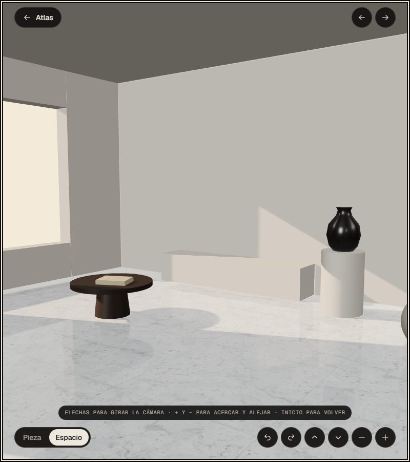
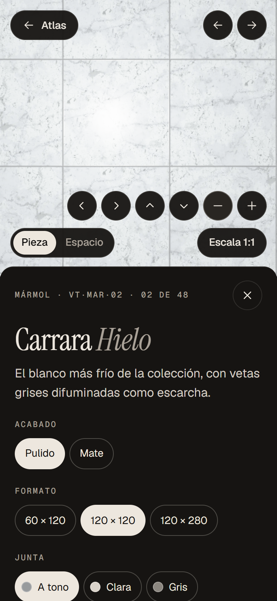

## Resultado

El 8 de octubre VETA era **parcialmente conforme** con las dos normas: fallaba 14 de los 44 requisitos de WCAG 2.2 AA que le aplican y 12 de 40 de WCAG 2.1 AA. Encontré 17 fallos, 6 de ellos graves. Los dos más serios: la estancia 3D solo se movía con gestos, y el distintivo que añade Netlify tapaba los botones de zoom.

Al día siguiente corregí los 15 que dependían del código y repetí la prueba de cada uno sobre la versión corregida. Ninguno se reproduce. Los otros dos eran del distintivo de Netlify, que se quitó en la configuración del sitio. Después publiqué la versión corregida y repetí las pruebas sobre la web en línea, con el mismo resultado.

Con eso, VETA es **plenamente conforme con WCAG 2.2 AA** (44 requisitos cumplidos, 12 no aplican) **y con WCAG 2.1 AA** (40 cumplidos, 10 no aplican), en la web publicada.

Al escuchar los filtros con NVDA apareció un fallo que la auditoría no vio: los avisos («10 superficies coinciden», «añadida a tu selección») no se leían con un diálogo abierto. Lo corregí, lo escuché con NVDA y el 10 de octubre comprobé que la web publicada ya lleva el arreglo.

## Qué tiene de difícil este proyecto

VETA es un mapa de 48 superficies pintado en WebGL 2 sobre un único `canvas`. Para un lector de pantalla, un `canvas` es una imagen sin nada dentro: ni muestras, ni nombres, ni posiciones. Y casi todo lo interesante del proyecto pasa ahí dentro: la luz que sigue al cursor, el atlas que se recorre arrastrando, el visor que muestra la pieza a escala real, la estancia 3D con reflejos.

El proyecto lo resuelve con una capa de HTML que va en paralelo al dibujo:

- Encima del lienzo hay una retícula invisible con `role="grid"`: 6 filas por 8 columnas, una celda por superficie. Cada celda tiene nombre («Granito Tostado. Granito, mate.»). Al moverse con las flechas, la cámara viaja hasta esa superficie y el anillo de foco se dibuja sobre la muestra real.
- El lienzo está marcado como decorativo (`aria-hidden`), así que el lector no tropieza con él.
- Hay un índice en HTML con las 48 superficies, una búsqueda y un minimapa. La misma superficie se encuentra por cuatro caminos.
- Los cinco paneles (ficha, filtros, búsqueda, selección y «Sobre el proyecto») son diálogos nativos.
- Si el navegador no tiene WebGL 2, la web enseña directamente el índice.

Donde esa capa no llegaba era en lo que se manejaba solo con gestos: la estancia 3D y el visor de la pieza. Ahí estaban los fallos más serios, y ahí ha ido la mayor parte del trabajo. El otro foco de problemas era todo lo que flota sobre las texturas: un anillo de foco o un texto que funciona sobre mármol negro puede desaparecer sobre mármol blanco.

## Cómo se ha comprobado

- **La auditoría (8 de octubre).** Una página, ocho estados y el pedido de muestras entero. axe-core 4.11.4 en 14 estados y dos tamaños. Teclado real parada a parada; toques reales con uno y dos dedos en 375×812; foco tapado comprobado en cinco puntos de cada elemento y en seis tamaños; contraste medido sobre el fondo real (texto transparente, percentil 5); zoom al 200 % y al 400 %, 320 px, horizontal, espaciado de texto, movimiento reducido y colores forzados. Chromium 148 sin ventana. El formulario no envía nada; aun así vigilé la red y usé `prueba@example.com`.
- **La corrección y la verificación (9 de octubre).** Cambié el código del proyecto y repetí, una a una, las pruebas de cada hallazgo sobre la versión corregida, servida en local con el mismo navegador y los mismos tamaños. El distintivo de Netlify no existe en local; para comprobar que ya no tapa los botones de zoom, inyecté en la página el script real de Netlify. Después, otra pasada de axe en los mismos 14 estados y el pedido de muestras entero con teclado, otra vez con la red vigilada.
- **Lo que oye un lector.** Con NVDA real (2026.2) escuché lo que más dudas daba: la estancia 3D, el visor de la pieza, las pestañas, los interruptores de «Proyecto» y el resumen de errores del formulario. Para no fiarme de lo que graba la herramienta, leí el registro interno de NVDA y comprobé con capturas que las flechas mueven la cámara de verdad. Esa escucha sacó tres ajustes más, ya hechos: la estancia y el visor pasaron a un rol que deja llegar las flechas, el resumen de errores dejó de leerse dos veces y los avisos pasaron a leerse también con un diálogo abierto. También escuché la retícula del atlas, la búsqueda y los filtros: todo se anuncia como debe.

Cada hallazgo tiene sus pasos para repetirlo y sus capturas de antes y de después.

## Lo que ya funcionaba

- **La retícula paralela funciona con teclado.** El primer Tab tras la cabecera cae en la superficie del centro de la pantalla. Las flechas recorren las 48 celdas y la cámara las sigue. El anillo de foco es doble (claro por fuera, oscuro por dentro), así que se ve igual sobre una textura clara que sobre una oscura. Intro abre la ficha; Escape la cierra y devuelve el foco a la misma celda.
- **Cuatro caminos a cada superficie.** Retícula, minimapa, búsqueda e índice. La búsqueda es un `combobox` con la opción activa marcada y anuncia el número de resultados. El índice es una lista de 48 botones con nombre, ordenable por tono, nombre o colección.
- **Los cinco diálogos se comportan como deben.** El foco entra en un elemento con nombre, se queda dentro, Escape cierra y el foco vuelve a donde estaba.
- **El enlace de salto existe y lleva a algún sitio.** «Saltar al índice de superficies» aparece con el primer Tab y deja el foco en el índice.
- **El formulario está bien resuelto.** Etiquetas visibles, «(opcional)» donde toca y `autocomplete` en nombre, correo y empresa. Cada campo con error muestra su mensaje debajo, queda marcado como inválido y lo asocia a su mensaje; el resumen recibe el foco. Al terminar, el foco va al título «Solicitud registrada».
- **Nada se mueve solo.** El atlas solo se repinta cuando algo cambia. La web lee la preferencia de movimiento reducido del sistema y además tiene su propio botón «Reducir movimiento».
- **Aguanta el zoom y la pantalla pequeña.** Al 200 %, con el espaciado de texto ampliado y en horizontal, no se corta ningún texto.
- **Objetivos grandes.** Los botones miden 40 px (44 px en pantallas táctiles; 36 px por debajo de 360 px de ancho).
- **Respeta los colores forzados.** No hay ninguna regla que los anule, y la celda enfocada usa el color de resaltado del sistema.
- **Idioma declarado.** La página es `lang="es"` y cambia a `en` con el botón «English», que lleva su propio `lang`.

## Lo que se encontró y cómo se ha arreglado

### Lo que solo se manejaba con gestos

- **La estancia 3D (H02 · 2.1.1, y también 2.5.7 y 2.5.1 · grave) — corregido.** *Antes:* la cámara giraba arrastrando y se acercaba con la rueda o pellizcando. Con el teclado no había manera: el lienzo ni siquiera recibía el foco. *Ahora:* la estancia recibe el foco con Tab, con su nombre y una descripción de las teclas. Las flechas giran la cámara, `+` y `−` acercan y alejan, Inicio vuelve a la vista de partida. Y en la pestaña «Espacio» hay seis botones visibles que hacen lo mismo con un toque: girar a la izquierda y a la derecha, subir y bajar la cámara, acercar y alejar. *Comprobado* con teclado, con ratón y con toques reales en el móvil: cada tecla y cada botón mueven la cámara, y ninguno cambia de superficie por error.
- **El visor de la pieza (H03 · 2.5.1, y también 2.5.7 · grave) — corregido.** *Antes:* en el móvil, un dedo solo movía la luz; para desplazar la pieza hacían falta dos. Con ratón, solo arrastrando. *Ahora:* un dedo desplaza la pieza en cuanto se mueve; un toque quieto sigue moviendo la luz. Y los mismos seis botones, en la pestaña «Pieza», desplazan en las cuatro direcciones, acercan y alejan. Preferí botones a «tocar para centrar»: en el móvil el toque ya mueve la luz, y quien usa control por voz puede decir el nombre de un botón, pero no señalar un punto de la imagen. *Comprobado:* el arrastre con un dedo, que antes no movía nada, cambia ahora casi la mitad de la imagen; cada botón, también.
- **El minimapa actuaba al pulsar (H16 · 2.5.2 · menor) — corregido.** *Ahora* el atlas viaja al soltar. Si arrastras por el minimapa y sueltas fuera, vuelve a donde estaba. *Comprobado:* con el botón pulsado no cambia nada; soltando fuera, la imagen queda idéntica a la de partida.

### Lo que pone Netlify

- **Tapaba los botones de zoom (H01 · 2.4.11 · grave · solo WCAG 2.2) — corregido.** *Ahora* la página detecta el distintivo y, si está, aparta los botones de zoom (en pantallas estrechas, el dock entero). Si no está, el diseño no cambia. *Comprobado* con el script real de Netlify inyectado, en seis tamaños: ningún botón queda debajo, y el toque en «Acercar» acerca el atlas en vez de abrir la tarjeta de Netlify.
- **Habla en inglés sin decirlo (H09 · 3.1.2 · moderado) y el título de su tarjeta no llega a 4,5:1 (H15 · 1.4.3 · menor) — resueltos al quitar el distintivo.** No estaban en el código de VETA y no se podían arreglar desde él. El distintivo se desactivó en la configuración del sitio y ya no aparece en la web. Si Netlify lo volviera a poner, volverían con él.

### Foco que no se veía o que se tapaba

- **El anillo naranja apenas contrastaba con las texturas (H06 · 1.4.11 · grave) — corregido.** *Ahora* todo lo que flota sobre las texturas (cabecera, filtros activos, dock, controles del visor, el visor y la estancia) usa el mismo anillo doble que ya tenían las celdas: claro por fuera, una banda oscura por dentro. *Comprobado:* entre los dos tonos hay entre 13,6:1 y 15,8:1 en todo el contorno. La técnica del W3C para anillos de dos colores (C40) pide 9:1 entre ellos, para que siempre destaque uno. Se ve igual sobre mármol blanco que sobre madera.
- **En «Filtrar superficies», el pie tapaba la opción enfocada (H04 · 2.4.11 · grave · solo WCAG 2.2) — corregido.** *Ahora* el navegador descuenta la cabecera y el pie fijos al desplazar la lista. *Comprobado* en seis tamaños: ninguna opción tapada. Antes eran hasta 16 al 400 %.
- **En «Espacio», una parada de foco invisible (H10 · 2.4.7 · menor) — corregido.** *Ahora* el visor de la pieza sale del orden de tabulación mientras está debajo de la estancia. *Comprobado:* cuarenta pulsaciones de Tab, ninguna cae en él.

### Pantallas pequeñas

- **A 320 px, «Proyecto» se salía de la pantalla (H05 · 1.4.10 · grave) — corregido.** *Ahora*, por debajo de 360 px de ancho, márgenes y botones algo más pequeños (36 px). *Comprobado:* a 320 px la cabecera entera cabe; «Proyecto» acaba a 10 px del borde.

### Contraste de textos y bordes

- **Rótulos sobre texturas claras (H11 · 1.4.3 · menor) — corregido.** Pastillas más opacas. *Comprobado* sobre las superficies más claras: el peor caso pasa de 3,3:1 a 5,75:1 en los rótulos del atlas y a 5,91:1 en la pista del visor. Se pide 4,5:1.
- **Chips de filtro con cero resultados (H12 · 1.4.3 · menor) — corregido.** Ya no se atenúan: van en gris con borde discontinuo. *Comprobado:* 7,29:1.
- **El borde de los campos de texto (H17 · 1.4.11 · moderado) — corregido.** Borde más claro solo en los campos. *Comprobado:* entre 4,2:1 y 4,8:1 contra el fondo y contra el propio campo. Se pide 3:1.

### Teclado

- **Siete atajos de una sola tecla (H07 · 2.1.4 · moderado) — corregido.** *Ahora* «Sobre el proyecto» tiene un interruptor «Atajos de una tecla», que se guarda como el de movimiento reducido. Vienen encendidos. Apagados, ninguna tecla suelta hace nada fuera del atlas; `+`, `−` y `0` solo actúan con el foco dentro del atlas, y `Ctrl K` sigue abriendo la búsqueda. *Comprobado:* las 24 combinaciones de la auditoría (cuatro focos por seis teclas), con el interruptor encendido y apagado.

### Lo que no llegaba al lector de pantalla

- **El resumen de errores no decía qué campo falla (H08 · 2.4.4 · moderado) — corregido.** *Ahora:* «Nombre: Este campo es obligatorio.», «Correo electrónico: …», «Proyecto y ciudad: …», «Consentimiento: …». Cada enlace lleva a su campo.
- **La marca de «en tu selección» solo se veía (H13 · 1.3.1 · menor) — corregido.** *Ahora* la celda se llama «Cal Blanca. Cal, mate. En tu selección.» y el botón del índice «Abrir ficha de Cal Blanca, en tu selección». Al quitarla de la selección, los nombres vuelven a ser los de antes.

### Ratón

- **El rótulo al pasar el ratón no se cerraba con Escape (H14 · 1.4.13 · menor) — corregido.** *Ahora* Escape lo oculta sin mover el puntero, hasta que pasas a otra superficie.

## Lo que apareció al corregir

- **«Reducir movimiento» perdía el foco (2.4.3 · menor) — corregido.** Al pulsarlo, el diálogo se volvía a pintar entero y el foco se perdía: el siguiente Tab volvía al primer botón del diálogo. La auditoría lo dio por bueno: no probé dónde quedaba el foco después de pulsar ese botón. Lo vi al tocar ese mismo código para añadir el interruptor de atajos, y lo confirmé en la web publicada. Ahora el foco se queda en el botón.
- **Ningún fallo nuevo en la regresión.** axe sigue sin encontrar errores en los 14 estados. El pedido de muestras se completa con teclado y no sale ninguna petición de red. Los controles nuevos no se pisan ni se tapan en ningún tamaño, aguantan el espaciado de texto ampliado y se ven en colores forzados.
- **Un precio a 400 %.** Para que los controles del visor quepan sin pisarse, a 320×225 el visor de la ficha es más alto y el panel de debajo se queda en 75 px visibles, con su propio scroll. En móviles normales no cambia nada.
- **De paso**, la pestaña activa («Pieza» o «Espacio») ahora se distingue de la otra; antes se veían iguales. Y la pista del visor enseña las teclas cuando el foco llega con el teclado.

## Resultado por principio

| Principio | Conformes | No conformes | No aplican | No evaluables |
|---|---|---|---|---|
| Perceptible | 14 (antes 9) | 0 (antes 5) | 6 | 0 |
| Operable | 19, 16 en 2.1 (antes 11, 10 en 2.1) | 0 (antes 8, 6 en 2.1) | 1 | 0 |
| Comprensible | 8 (7 en 2.1) | 0 (antes 1) | 5 (3 en 2.1) | 0 |
| Robusto (con 9.7) | 3 | 0 | 0 | 0 |
| **Total WCAG 2.2 AA + 9.7 (56)** | **44** (antes 30) | **0** (antes 14) | **12** | **0** |
| **Total WCAG 2.1 AA (50)** | **40** (antes 28) | **0** (antes 12) | **10** | **0** |

Veredicto: **plenamente conforme** con WCAG 2.2 AA + 9.7 y con WCAG 2.1 AA. Ningún requisito queda sin cumplir ni sin evaluar.

## Límites de esta evaluación

- **Verificado en local y en la web publicada.** Las pruebas se hicieron sobre la versión corregida en local y se repitieron sobre https://vetaatlas.com/ ya publicada.
- **NVDA, en los recorridos principales.** Estancia 3D, visor, pestañas, interruptores, formulario, retícula, búsqueda, filtros y selección, con NVDA real. El resto, con el árbol de accesibilidad.
- **Netlify cambia sin avisar.** El distintivo depende de la configuración del proveedor. Hoy está quitado; si vuelve, la página ya aparta los controles de zoom, pero trae su propio texto sin idioma declarado.
- **Un navegador.** Chromium sin ventana y WebGL por software. No he probado Safari, Firefox, VoiceOver, TalkBack ni GPU real.
- **Solo en español.** La versión inglesa comparte código y los textos nuevos existen en inglés, pero no se han revisado.
- **Texturas de muestra.** El contraste sobre textura lo he medido sobre las superficies más claras, que son las que peor lo ponen. Con otra posición de la cámara puede haber combinaciones algo distintas.
- **Lo he evaluado y corregido yo, que lo hice.** Por eso cada hallazgo lleva pasos para que cualquiera los repita, antes y después, y por eso cuento también el fallo que se me escapó.
- **No es una certificación.** Es una evaluación técnica en una fecha, sobre una muestra de estados. VETA no tiene obligación legal de cumplir; esta ficha sirve para enseñar en qué punto estaba y qué se ha hecho.

---

## Anexo — Los 57 requisitos, después de las correcciones

Norma: «2.1 y 2.2» cuenta para los dos veredictos; «2.2» solo para WCAG 2.2; «solo 2.1» solo para WCAG 2.1; «V4.1.1» es el requisito 9.7 de EN 301 549 V4.1.1. Los `H##` son los hallazgos descritos más arriba.

### Perceptible

| Criterio | Nivel | Norma | Estado | Nota |
|---|---|---|---|---|
| 1.1.1 Contenido no textual | A | 2.1 y 2.2 | Conforme | Lienzo decorativo con retícula paralela; visores con nombre |
| 1.2.1 Solo audio y solo vídeo (grabado) | A | 2.1 y 2.2 | No aplica | Sin audio ni vídeo |
| 1.2.2 Subtítulos (grabado) | A | 2.1 y 2.2 | No aplica | Sin vídeo |
| 1.2.3 Audiodescripción o alternativa (grabado) | A | 2.1 y 2.2 | No aplica | Sin vídeo |
| 1.2.4 Subtítulos (en directo) | AA | 2.1 y 2.2 | No aplica | Sin emisiones en directo |
| 1.2.5 Audiodescripción (grabado) | AA | 2.1 y 2.2 | No aplica | Sin vídeo |
| 1.3.1 Información y relaciones | A | 2.1 y 2.2 | Conforme | H13 corregido |
| 1.3.2 Secuencia con significado | A | 2.1 y 2.2 | Conforme |  |
| 1.3.3 Características sensoriales | A | 2.1 y 2.2 | Conforme |  |
| 1.3.4 Orientación | AA | 2.1 y 2.2 | Conforme |  |
| 1.3.5 Identificar el propósito de la entrada | AA | 2.1 y 2.2 | Conforme |  |
| 1.4.1 Uso del color | A | 2.1 y 2.2 | Conforme |  |
| 1.4.2 Control del audio | A | 2.1 y 2.2 | No aplica | Sin audio |
| 1.4.3 Contraste (mínimo) | AA | 2.1 y 2.2 | Conforme | H11 y H12 corregidos; H15 resuelto al quitar el distintivo de Netlify |
| 1.4.4 Cambio de tamaño del texto | AA | 2.1 y 2.2 | Conforme |  |
| 1.4.5 Imágenes de texto | AA | 2.1 y 2.2 | Conforme |  |
| 1.4.10 Reajuste de los elementos (reflow) | AA | 2.1 y 2.2 | Conforme | H05 corregido |
| 1.4.11 Contraste no textual | AA | 2.1 y 2.2 | Conforme | H06 y H17 corregidos |
| 1.4.12 Espaciado del texto | AA | 2.1 y 2.2 | Conforme |  |
| 1.4.13 Contenido con el puntero o el foco | AA | 2.1 y 2.2 | Conforme | H14 corregido |

### Operable

| Criterio | Nivel | Norma | Estado | Nota |
|---|---|---|---|---|
| 2.1.1 Teclado | A | 2.1 y 2.2 | Conforme | H02 corregido |
| 2.1.2 Sin trampas para el foco del teclado | A | 2.1 y 2.2 | Conforme |  |
| 2.1.4 Atajos de teclado con un solo carácter | A | 2.1 y 2.2 | Conforme | H07 corregido |
| 2.2.1 Tiempo ajustable | A | 2.1 y 2.2 | Conforme |  |
| 2.2.2 Poner en pausa, detener, ocultar | A | 2.1 y 2.2 | Conforme |  |
| 2.3.1 Umbral de tres destellos o menos | A | 2.1 y 2.2 | Conforme |  |
| 2.4.1 Evitar bloques | A | 2.1 y 2.2 | Conforme |  |
| 2.4.2 Titulado de páginas | A | 2.1 y 2.2 | Conforme |  |
| 2.4.3 Orden del foco | A | 2.1 y 2.2 | Conforme | Fallo en «Reducir movimiento» visto al corregir; corregido |
| 2.4.4 Propósito de los enlaces (en contexto) | A | 2.1 y 2.2 | Conforme | H08 corregido |
| 2.4.5 Múltiples vías | AA | 2.1 y 2.2 | No aplica | Una sola página web |
| 2.4.6 Encabezados y etiquetas | AA | 2.1 y 2.2 | Conforme |  |
| 2.4.7 Foco visible | AA | 2.1 y 2.2 | Conforme | H10 corregido |
| 2.4.11 Foco no oscurecido (mínimo) | AA | 2.2 | Conforme | H01, H04 y H10 corregidos |
| 2.5.1 Gestos del puntero | A | 2.1 y 2.2 | Conforme | H02 y H03 corregidos |
| 2.5.2 Cancelación del puntero | A | 2.1 y 2.2 | Conforme | H16 corregido |
| 2.5.3 Etiqueta en el nombre | A | 2.1 y 2.2 | Conforme |  |
| 2.5.4 Activación mediante movimiento | A | 2.1 y 2.2 | Conforme |  |
| 2.5.7 Movimientos de arrastre | AA | 2.2 | Conforme | H02 y H03 corregidos |
| 2.5.8 Tamaño del objetivo (mínimo) | AA | 2.2 | Conforme |  |

### Comprensible

| Criterio | Nivel | Norma | Estado | Nota |
|---|---|---|---|---|
| 3.1.1 Idioma de la página | A | 2.1 y 2.2 | Conforme |  |
| 3.1.2 Idioma de las partes | AA | 2.1 y 2.2 | Conforme | H09 resuelto al quitar el distintivo de Netlify |
| 3.2.1 Al recibir el foco | A | 2.1 y 2.2 | Conforme |  |
| 3.2.2 Al recibir entradas | A | 2.1 y 2.2 | Conforme |  |
| 3.2.3 Navegación coherente | AA | 2.1 y 2.2 | No aplica | Una sola página web |
| 3.2.4 Identificación coherente | AA | 2.1 y 2.2 | No aplica | Una sola página web |
| 3.2.6 Ayuda coherente | A | 2.2 | No aplica | Una sola página web, sin mecanismos de ayuda repetidos |
| 3.3.1 Identificación de errores | A | 2.1 y 2.2 | Conforme |  |
| 3.3.2 Etiquetas o instrucciones | A | 2.1 y 2.2 | Conforme |  |
| 3.3.3 Sugerencias ante errores | AA | 2.1 y 2.2 | Conforme |  |
| 3.3.4 Prevención de errores (legales, financieros, datos) | AA | 2.1 y 2.2 | No aplica | El pedido de muestras no tiene efectos legales ni económicos |
| 3.3.7 Entrada redundante | A | 2.2 | Conforme |  |
| 3.3.8 Autenticación accesible (mínimo) | AA | 2.2 | No aplica | Sin inicio de sesión |

### Robusto

| Criterio | Nivel | Norma | Estado | Nota |
|---|---|---|---|---|
| 4.1.1 Procesamiento | A | solo 2.1 | Conforme | Siempre satisfecho en HTML (nota del W3C) |
| 4.1.2 Nombre, función, valor | A | 2.1 y 2.2 | Conforme | Estancia, visor, pestañas e interruptores escuchados con NVDA |
| 4.1.3 Mensajes de estado | AA | 2.1 y 2.2 | Conforme | Escuchado con NVDA: resumen de errores, resultados de filtros y selección (los avisos con un diálogo abierto, corregidos el 9-10 y publicados el 10-10) |
| 9.7 Preferencias del usuario (EN 301 549) | — | V4.1.1 | Conforme |  |

**WCAG 2.1 AA · EN 301 549 V3.2.1:** 40 conformes · 0 no conformes · 10 no aplican · 0 no evaluables → **plenamente conforme** (el 8 de octubre: 28 · 12 · 10 · 0, parcialmente conforme).
**WCAG 2.2 AA + 9.7 · EN 301 549 V4.1.1:** 44 conformes · 0 no conformes · 12 no aplican · 0 no evaluables → **plenamente conforme** (el 8 de octubre: 30 · 14 · 12 · 0, parcialmente conforme).
